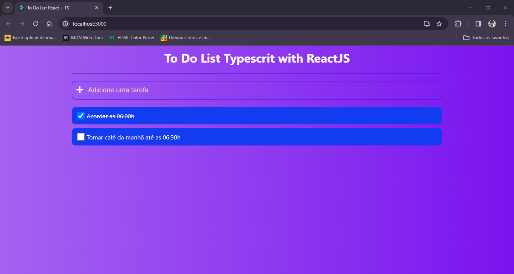

<h1 align = "center"> Olá, seja bem-vindo ao meu projeto! </h1>
 
<h2 align = "center"> Este é um projeto simples, uma To Do List feita com React e TS, porém, feito para por em prática meus conhecimentos com ambas tecnologias. </h2>
 

 Com essa To Do List é possível adicionar tarefa e marcar se elas foram completadas ou não. Ao marcar como completo clicando na check box, é feito um traço em cima dela. Nesta To Do List, é possível adicionar tarefas simplesmente escrevendo o titulo dela e clicando no sinal de mais ou no botão enter. 

 

 Abaixo você poderá ver algumas prints do projeto.

 
<h3 align = "center"> To Do List React + TS</h3>
 

 
<h3 align = "center"> Exemplo de lista de tarefa</h3>
 

 
